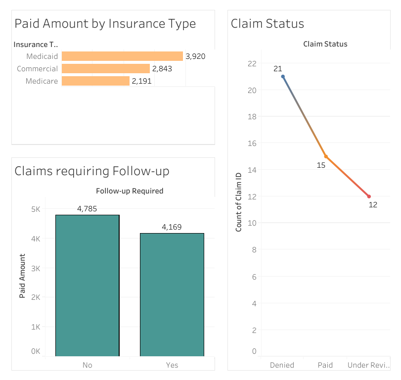

# Healthcare Claim Analysis
Interactive Tableau dashboard analyzing healthcare claims data to uncover trends in insurance payouts, claim statuses, and follow-up rates.

Dataset sourced from **Alex The Analyst’s GitHub repository** on healthcare analytics for educational and portfolio use.

**Project Overview:**

This project focuses on analyzing a healthcare claims dataset to identify financial trends, operational patterns, and opportunities for administrative improvements. Using a cleaned sample of claims data, we created key performance indicators (KPIs) and visualized them using Tableau to support decision-making in a healthcare finance context.

**Dataset** :

Source: [Alex The Analyst's Github - HealthcareAnalytics](https://github.com/AlexTheAnalyst/HealthcareAnalytics/blob/main/claims_data.csv)

Data Used: claims_data.csv (60-row sample cleaned and converted to .xlsx for Tableau)

**Tools Used** :

Python(Pandas) : Data sampling, cleaning, and formatting

Excel: Data cleaning and preparation

Tableau: KPI dashboards and data storytelling

**Data Cleaning & Preparation** : 

- Selected a sample of 60 rows from a larger claims dataset.

- Removed missing values and standardized date formats.

- Standardized Date Formats and Renamed Columns for Clarity

**Key KPIs** :

1. Total Paid Amount

2. Average Paid Amount

3. Claim Approval Rate (based on 'Paid' status)

4. Follow-up required (based on 'Yes' values)

**Dashboards** :

1. Bar Charts
 
   Total Paid Amount by Insurance Type
   
   Follow-Up Required (Yes/No)

2. Line Chart

   Claim Status Distribution

   

4. Interactive Table

   Claims by ID, Date, Status, and Insurance Type

   

**Key Insights from Python Data Exploration** :

1. The insurance provider contributing the highest total paid amount is **Medicaid**, accounting for **3920** in reimbursements.

2. The average claim payout is **$ 184.2**, with a total paid amount of **$ 11051**.

3. Approximately **28.3%** of claims were approved, while 50% required a follow-up.

4. Follow-up required claims signal either unresolved diagnoses or admininstrative delays.

**What I Achieved through this Project** :

- Identified payout trends by insurance type, highlighting which insurers contributed most to reimbursement totals.

- Calculated a claim approval rate, offering insight into efficiency of processing and denial patterns.

- Measured follow-up burden, which can signal operational delays or incomplete documentation.

- Built a professional dashboard that combines high-level KPIs with detailed data exploration tools.

- Made the data usable for administrative decision-making, reporting, or further healthcare analytics.

Author
Sudha Sahithi Murikipudi
Aspiring Healthcare Data Analyst | Master’s in Data Science
Connect with me on Linkedin : 
